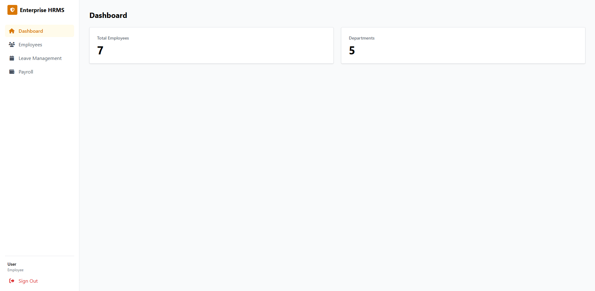
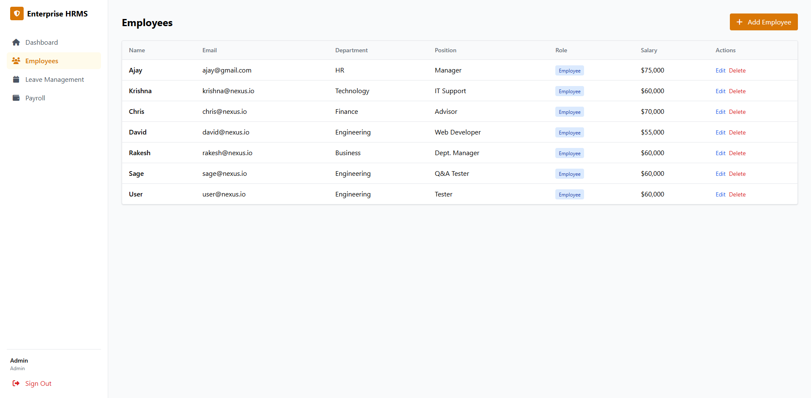
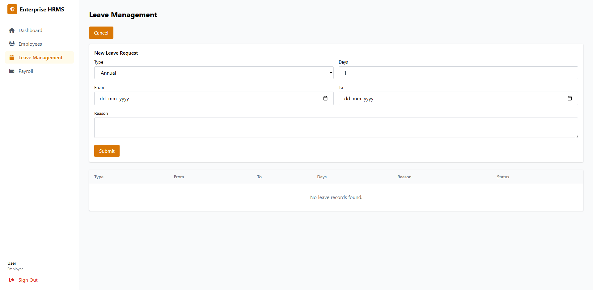
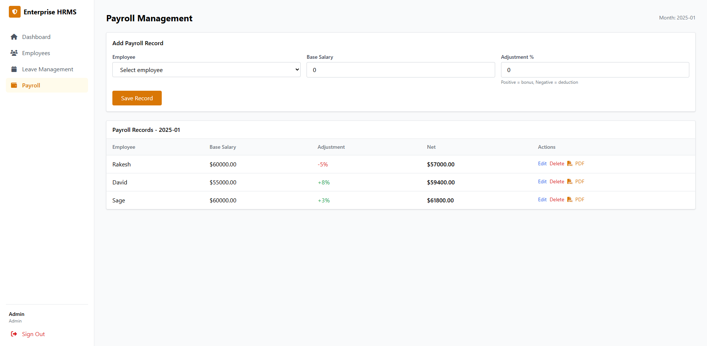
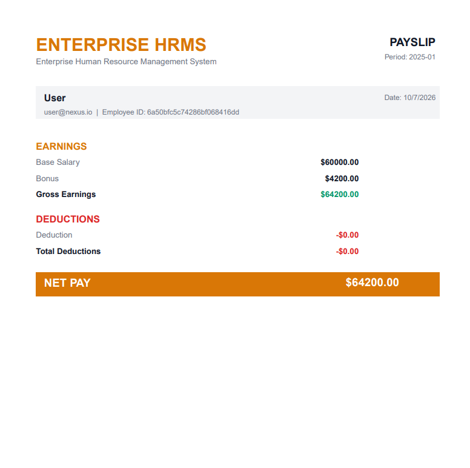

# 🧑‍💼 Nexus HRMS – Enterprise Human Resource Management System

[](https://nodejs.org/)
[](https://expressjs.com/)
[](https://mongodb.com/)
[](https://reactjs.org/)
[](https://tailwindcss.com/)
[](https://www.typescriptlang.org/)
[](https://opensource.org/licenses/MIT)

> A full‑featured HRMS (Human Resource Management System) built with the MERN stack + TypeScript, featuring Role‑Based Access Control, leave management, payroll automation, and PDF payslip generation.

---

## 📌 Table of Contents

- [Overview](#-overview)
- [Features](#-features)
- [Tech Stack](#-tech-stack)
- [Architecture](#-architecture)
- [Installation & Setup](#-installation--setup)
- [Running the Application](#-running-the-application)
- [API Endpoints (v1)](#-api-endpoints-v1)
- [Screenshots](#-screenshots)
- [Roadmap](#-roadmap)
- [Contributing](#-contributing)
- [License](#-license)

---

## 🧾 Overview

**Nexus HRMS** is a secure, scalable, and user‑friendly platform designed to streamline human resource operations. It empowers administrators and HR managers to handle employee onboarding, leave requests, payroll processing, and automated payslip generation – all within a single, modern web application.

Employees can view their colleagues, request time off, and access their own payslips, while HR/Admin have full control over employee records, leave approvals, and payroll adjustments.

---

## ✨ Features

### 👑 Admin / HR
- **Dashboard** – Overview of total employees, departments, and pending leaves.
- **Employee Management** – Add, edit, delete employees (full CRUD) with an intuitive multi‑step wizard.
- **Leave Management** – View all leave requests, accept or reject with a single click.
- **Payroll Management** – Create, update, delete payroll records; adjust salary bonuses/deductions (-100% to +100%).
- **PDF Payslip** – Automatically generate and download a formatted payslip for any employee.
- **Secure RBAC** – Middleware ensures only authorised roles can access sensitive endpoints.

### 👥 Employee
- **Dashboard** – View organisation‑wide statistics (read‑only).
- **Employee Directory** – Browse colleagues with basic info (name, email, department, role).
- **Leave Requests** – Submit leave requests and track their status (pending, approved, rejected).
- **Payroll** – View personal payroll details and download PDF payslip.

---

## 🛠️ Tech Stack

| Category       | Technology                                                  |
|----------------|-------------------------------------------------------------|
| Backend        | Node.js, Express.js, TypeScript                             |
| Database       | MongoDB Atlas (NoSQL) with Mongoose ODM                    |
| Authentication | JWT, bcrypt password hashing, Helmet, rate‑limiting        |
| Frontend       | React 19, Vite, TypeScript                                 |
| Styling        | Tailwind CSS v4 (via Vite plugin)                          |
| State Management | React Query (server‑state caching)                        |
| PDF Generation | PDFKit (server‑side)                                       |
| Containerisation| Docker & Docker Compose (optional)                        |
| CI/CD          | GitHub Actions (ready for pipeline)                        |

---

## 🧱 Architecture

- **Backend** – RESTful API with Express, split into controllers, models, routes, and middleware.  
- **Frontend** – Single‑page React application with lazy loading, reusable components, and a clean dashboard layout.  
- **Security** – JWT stored in `localStorage`; every request is validated with role‑based middleware.  
- **Database** – MongoDB collections: `users`, `employees`, `leaves`, `payrolls`.  
- **PDF Generation** – Triggered by a GET request, generates a ready‑to‑download PDF using `pdfkit`.

---

## 📦 Installation & Setup

### Prerequisites
- Node.js (v20 or later)
- npm or yarn
- MongoDB Atlas account (or local MongoDB instance)

### 1. Clone the repository
```bash
git clone https://github.com/yourusername/hrms-project.git
cd hrms-project
```

### 2. Backend setup
```bash
cd server
cp .env.example .env   # create environment file
npm install
```

Edit `.env` with your MongoDB URI and JWT secret.

### 3. Frontend setup
```bash
cd ../client
npm install
```

### 4. Run the application
- **Backend** (from `server/`): `npm run dev`
- **Frontend** (from `client/`): `npm run dev`

The frontend will be available at `http://localhost:5173` and the API at `http://localhost:5000`.

---

## 🚀 Running the Application

### Manual (development)
```bash
# Terminal 1 – Backend
cd server && npm run dev

# Terminal 2 – Frontend
cd client && npm run dev
```

### Docker (production ready)
```bash
docker-compose up --build
```
This will start MongoDB, the backend, and the frontend (via nginx) on port 80.

### Seed Admin Account
The backend automatically seeds an admin user on first run:
- **Email:** `admin@nexus.io`
- **Password:** `admin123`

You can also register as an employee and manually update the role in the database.

---

## 📡 API Endpoints (v1)

All endpoints (except `/auth/*`) require a **Bearer token** in the `Authorization` header.

| Method | Endpoint                      | Description                        | Access |
|--------|-------------------------------|------------------------------------|--------|
| POST   | `/api/auth/register`          | Register a new employee            | Public |
| POST   | `/api/auth/login`             | Login and receive JWT              | Public |
| GET    | `/api/employees`              | List all employees                 | Auth   |
| POST   | `/api/employees`              | Create a new employee              | HR/Admin |
| PUT    | `/api/employees/:id`          | Update employee details            | HR/Admin |
| DELETE | `/api/employees/:id`          | Delete employee                    | Admin |
| GET    | `/api/leaves/my`              | Get logged‑in employee's leaves    | Auth   |
| GET    | `/api/leaves/all`             | Get all leaves                     | HR/Admin |
| POST   | `/api/leaves`                 | Submit a leave request             | Auth   |
| PUT    | `/api/leaves/:id`             | Approve/reject a leave             | HR/Admin |
| GET    | `/api/payroll/my`             | Get own payroll for a month        | Auth   |
| GET    | `/api/payroll/all`            | Get all payroll for a month        | HR/Admin |
| POST   | `/api/payroll`                | Create/update payroll record       | HR/Admin |
| DELETE | `/api/payroll/:id`            | Delete a payroll record            | HR/Admin |
| GET    | `/api/payroll/:id/pdf`        | Download payslip PDF               | Auth   |
| GET    | `/api/stats/departments`      | Department headcount & salary stats| Auth   |
| GET    | `/api/stats/pending-leaves`   | List pending leaves                | Auth   |

---

## 📸 Screenshots

*(Add actual screenshots of your application here)*

- **Dashboard**
  

- **Employees (Admin)**
  

- **Leave Management**
  

- **Payroll Management**
  

- **PDF Payslip**
  

---

## 🗺️ Roadmap

- [x] Secure JWT authentication & RBAC
- [x] Employee CRUD with wizard
- [x] Leave request & approval workflow
- [x] Payroll management with adjustment %
- [x] PDF payslip generation
- [x] Docker support
- [x] Full‑fledged React frontend with React Query
- [ ] Email notifications (on leave status change)
- [ ] Real‑time updates with WebSockets
- [ ] Advanced payroll reports (CSV/Excel export)
- [ ] Multi‑tenancy (multiple companies)

---

## 🤝 Contributing

Contributions are welcome! Please follow these steps:

1. Fork the repository.
2. Create a new branch: `git checkout -b feature/your-feature`.
3. Commit your changes: `git commit -m 'Add some feature'`.
4. Push to the branch: `git push origin feature/your-feature`.
5. Open a Pull Request.

Please ensure your code adheres to the existing style and includes appropriate tests.

---

## 📄 License

This project is licensed under the MIT License – see the [LICENSE](LICENSE) file for details.

---

## ⚡ Acknowledgements

- [MongoDB Atlas](https://mongodb.com/) for the cloud database.
- [PDFKit](https://pdfkit.org/) for PDF generation.
- [Tailwind CSS](https://tailwindcss.com/) for beautiful, fast styling.
- [React Query](https://tanstack.com/query) for efficient server‑state management.

---

**Built with ❤️ by [Prathmesh M](https://github.com/yourusername)**
*Special thanks to the Infotact Technical Internship Program for the project vision.*
